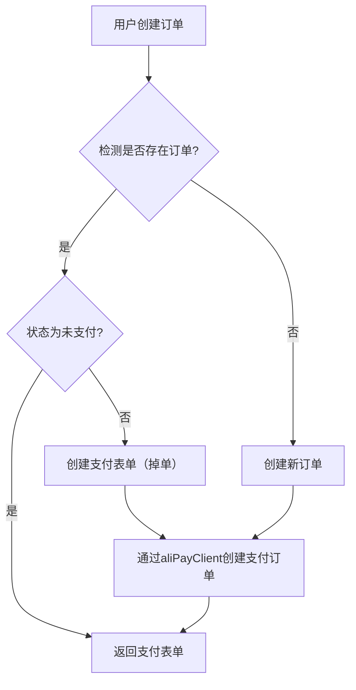
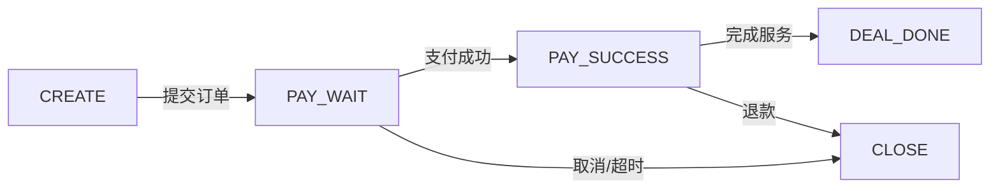

### 项目业务概述

用户进入网页，展示商品列表，点击购买后，如果没有没有登录，则跳转微信二维码登录，完成登录后返回商品页面，继续购买流程。

该项目有以下几个重点需要学习：

1. DDD（领域驱动设计）概念的理解和应用
2. 微信组件在鉴权方面的应用细节
3. 支付宝沙箱环境的使用，回调处理以及一致性实现

### DDD（Domain-driven design）概念

在学习新概念时，最好在已有的知识体系中进行类比学习，DDD作为一种架构模式，可以和MVC对比学习

MVC(Model View Controller)注重的是**分离展示与业务逻辑**，体现在代码结构中就是`service`、`dao`、`controller`等层次的分离。
有以下几个比较不方便的点

- 职责边界模糊
  - 每当有新需求，会直接在`entiry`、`service`层下添加新的实体类、`xxxService`接口和实现类，这使得在后期维护阶段，因为对业务逻辑没有进一步细分，各个部分的业务混杂在一起，`service`层下全是`xxxService`，文件较多时，甚至只能通过`ctrl+shift+n`找到
- 耦合度高
  - 当比较基础且使用地方较多的逻辑代码需要改动时(多个Service使用同一块基础逻辑代码)，不仅基础代码需要改动，使用基础代码的地方也需要改动

DDD则强调**领域模型的设计和业务逻辑的聚焦**  
为了解决上面的问题

- DDD提出了`充血模型`的概念，是指将对象的属性信息与行为逻辑聚合，不再像MVC一样根据类型分类(比如UserService和OrderService放在一起 被称为贫血模型)，而是根据业务业务分类(比如`UserService`和`UserEntity`放在一起 充血模型)
- 深度使用**适配器模式(Adapter Pattern)**，将基础逻辑和业务逻辑解耦，DDD架构中，有具体的`infrastructure`用于封装基础逻辑，包括对微信、商品rpc服务的请求(gateway)，数据层的访问(dao)，以及应外部domain需求的接口实现(adapter infrastructure下的adapter和domain下每个领域的adapter是对应关系)。

以下是一个ddd项目的大致项目结构

```sh
- api Controller的定义 属于interface

- app 启动文件Application和配置config

- domain 存放各个领域的逻辑代码
	- auth 鉴权领域
		- adapter 需要用到的基础api 由infrastructure实现
			- port 外部访问相关接口 如rpc
			- repository 数据库
		- service 领域相关逻辑代码
		- model 相关数据类
			- entity
			- vo
	- order

- infrastructure 基础逻辑
	- adapter 实现各个领域的需求
		- port
		- repository 一般是调用dao
	- dao
	- gateway 外部服务封装
	- xxx 其他服务

- trigger 触发器 包含所有可以调用服务的代码
	- http 存放Controller
	- job 定时任务
	- listener 时间监听回调

- types 其他定义 比如异常 枚举类等等
	- exception
	- constant
```

### 微信鉴权实现

大致需要分为两部分 微信公众号对接和登录二维码

#### 微信公众号对接

[公众平台](https://mp.weixin.qq.com/debug/cgi-bin/sandboxinfo?action=showinfo&t=sandbox/index) 用于获取测试公众号

对接公众号需要完成两个接口，负责验签和处理公众号的消息  
两个函数路径相同，都是`receive`，但方法不同，验签为GET，处理公众号信息的为POST

```java
@Value("${weixin.config.originalid}")
private String originalid;
@Value("${weixin.config.token}")
private String token;

// 微信服务器验签
@GetMapping(value = "receive", produces = "text/plain;charset=utf-8")
public String validate(@RequestParam(value = "signature", required = false) String signature,
                       @RequestParam(value = "timestamp", required = false) String timestamp,
                       @RequestParam(value = "nonce", required = false) String nonce,
                       @RequestParam(value = "echostr", required = false) String echostr) {
    try {
        log.info("微信公众号验签信息开始 [{}, {}, {}, {}]", signature, timestamp, nonce, echostr);
        if (StringUtils.isAnyBlank(signature, timestamp, nonce, echostr)) {
            throw new IllegalArgumentException("请求参数非法，请核实!");
        }
        boolean check = SignatureUtil.check(token, signature, timestamp, nonce);
        log.info("微信公众号验签信息完成 check：{}", check);
        if (!check) {
            return null;
        }
        return echostr;
    } catch (Exception e) {
        log.error("微信公众号验签信息失败 [{}, {}, {}, {}]", signature, timestamp, nonce, echostr, e);
        return null;    }
}

// 用于处理公众号收到的消息
@PostMapping(value = "receive", produces = "application/xml; charset=UTF-8")
public String post(@RequestBody String requestBody,
                   @RequestParam("signature") String signature,
                   @RequestParam("timestamp") String timestamp,
                   @RequestParam("nonce") String nonce,
                   @RequestParam("openid") String openid,
                   @RequestParam(name = "encrypt_type", required = false) String encType,
                   @RequestParam(name = "msg_signature", required = false) String msgSignature) {
    try {
        log.info("接收微信公众号信息请求{}开始 {}", openid, requestBody);
        // 消息转换
		// 截断登录事件
        MessageTextEntity message = XmlUtil.xmlToBean(requestBody, MessageTextEntity.class);
        if ("event".equals(message.getMsgType()) && "SCAN".equals(message.getEvent())){
		     // 记录当前用户的openid
            loginService.saveLoginState(message.getTicket(), openid);
            return buildMessageTextEntity(openid, "登录成功");
        }

        // 返回`你好, xx`
        return buildMessageTextEntity(openid, "你好，" + message.getContent());
    } catch (Exception e) {
        log.error("接收微信公众号信息请求{}失败 {}", openid, requestBody, e);
        return "";
    }
}
```

之后需要在公众平台完成接口配置信息绑定，服务需被外网访问，为了方便这里通过natapp内网穿透使得服务可以被访问

绑定完成后，测试公众号可以对收到的信息进行处理

#### 登录二维码获取

登录相对来说比较复杂，有三个关键，accessToken、ticket和openid

其中

- accessToken是用于访问微信服务器的通行证，通过`appid`和`appSecret`来获取(二者在公众号测试平台可以找到)，微信提供了相关的[接口](https://developers.weixin.qq.com/doc/service/guide/dev/)
- ticket用于生成二维码，通过`accessToken`和二维码参数生成，[参考](https://developers.weixin.qq.com/doc/service/api/qrcode/qrcodes/api_createqrcode.html)
- openid是用户的唯一标识，用户扫码后，回调函数可以获取用户的openid，存入缓存以记录用户登录状态

整个流程如下

- 二维码生成
  - 前端请求ticket
  - 后端收到请求，获取accessToken，进而获取ticket并返回
  - 前端获取到ticket后，通过ticket请求微信服务端获取二维码图片
- 用户扫描二维码
  - 前端轮询登录状态
  - 成功扫码后，后台通过公众号信息的回调获取并存储用户openid

### 支付实现

#### 支付宝沙箱环境配置

支付宝的对接也需要有回调函数，与微信不同，支付宝有客户端使用，无需在他们的平台进行信息绑定

```xml
<dependency>
    <groupId>com.alipay.sdk</groupId>
    <artifactId>alipay-sdk-java</artifactId>
    <version>4.38.157.ALL</version>
</dependency>
```

alipay客户端配置

```yml
alipay:
  enabled: true
  # 测试平台得到
  app_id:
  # 商家私钥 测试平台得到
  merchant_private_key:
  # 阿里pay的公钥 通过阿里秘钥工具获得
  alipay_public_key:
  # 回调接口 需要开发者定义
  notify_url:
  # 支付完成后跳转的网址
  return_url:
  # 网关地址 固定
  gatewayUrl: https://openapi-sandbox.dl.alipaydev.com/gateway.do
```

```java

/**
 * 回调函数
 */
@RequestMapping(value = "alipay_notify_url", method = RequestMethod.POST)
public String payNotify(HttpServletRequest request) throws AlipayApiException {
    log.info("支付回调，消息接收 {}", request.getParameter("trade_status"));

    if (!request.getParameter("trade_status").equals("TRADE_SUCCESS")) {
        return "false";
    }

    Map<String, String> params = new HashMap<>();
    Map<String, String[]> requestParams = request.getParameterMap();
    for (String name : requestParams.keySet()) {
        params.put(name, request.getParameter(name));
    }

    String tradeNo = params.get("out_trade_no");
    String gmtPayment = params.get("gmt_payment");
    String alipayTradeNo = params.get("trade_no");

    String sign = params.get("sign");
    String content = AlipaySignature.getSignCheckContentV1(params);
    boolean checkSignature = AlipaySignature.rsa256CheckContent(content, sign, alipayPublicKey, "UTF-8"); // 验证签名
    // 支付宝验签
    if (!checkSignature) {
        return "false";
    }

    // 验签通过
    log.info("支付回调，交易名称: {}", params.get("subject"));
    log.info("支付回调，交易状态: {}", params.get("trade_status"));
    log.info("支付回调，支付宝交易凭证号: {}", params.get("trade_no"));
    log.info("支付回调，商户订单号: {}", params.get("out_trade_no"));
    log.info("支付回调，交易金额: {}", params.get("total_amount"));
    log.info("支付回调，买家在支付宝唯一id: {}", params.get("buyer_id"));
    log.info("支付回调，买家付款时间: {}", params.get("gmt_payment"));
    log.info("支付回调，买家付款金额: {}", params.get("buyer_pay_amount"));
    log.info("支付回调，支付回调，更新订单 {}", tradeNo);
	 // 更新订单状态
    orderService.changeOrderPaySuccess(tradeNo);

    return "success";
}
```

#### 订单业务实现

需要明确的是，支付也是类似微信登录，会在支付时跳转到支付表单(pay_form 专业名词为唤起收银台)

- 用户创建订单
  - 后台根据用户id和产品id
    _ 检测是否已有订单
    _ 存在订单
    _ 订单状态为未支付 则直接返回支付表单  
     _ 没有创建支付表单 则通过aliPayClient创建支付订单  
     \* 不存在订单 则创建订单和支付表单



#### 订单状态一致性

考虑到本地服务和支付宝并不是一个事务，无法保证操作的原子性(即本地服务如果崩溃 则已经完成的订单不会被更新) 因此需要额外的手段保证数据一致性

给订单类创建状态列用于标识方便处理，枚举类内部有`CREATE`、`PAY_WAIT`、`PAY_SUCCESS`、`DEAL_DONE`和`CLOSE`



其中，从`PAY_WAIT`到`PAY_SUCCESS` 和 `PAY_WAIT`到`CLOSE`需要额外处理  
前者是因为: 如果用户支付成功，但本地服务崩溃，支付宝服务器无法正常调用回调更新订单状态，需要主动轮询更新  
后者则是因为超时需要主动更新，因此也需要主动轮询

### 其他

#### Retrofit配置http请求

做微信登录时，需要向微信服务器发送很多http请求，Retrofit通过注解能让这个需求更加优雅地完成

Retrofit配置

```java
@Slf4j
@Configuration
public class Retrofit2Config {

    private static final String BASE_URL = "https://api.weixin.qq.com/";

    @Bean
    public Retrofit retrofit() {
        return new Retrofit.Builder()
                .baseUrl(BASE_URL)
                .addConverterFactory(JacksonConverterFactory.create()).build();
    }

    @Bean
    public IWeixinApiService weixinApiService(Retrofit retrofit) {
        return retrofit.create(IWeixinApiService.class);
    }
}
```

具体接口

```java
public interface IWeixinApiService {
	 // 定义方法和路径
    @GET("cgi-bin/token")
    Call<WeixinTokenResponseDTO> getToken(@Query("grant_type") String grantType,
                                          @Query("appid") String appId,
                                          @Query("secret") String appSecret);
    @POST("cgi-bin/qrcode/create")
    Call<WeixinQrCodeResponseDTO> createQrCode(@Query("access_token") String accessToken, @Body WeixinQrCodeRequestDTO weixinQrCodeRequestDTO);

    @POST("cgi-bin/message/template/send")
    Call<Void> sendMessage(@Query("access_token") String accessToken, @Body WeixinTemplateMessageDTO weixinTemplateMessageDTO);
}
```

使用时

```java
// 发送请求
Call<WeixinTokenRes> call = weixinApiService.getToken("client_credential", appid, appSecret);
// 解包
WeixinTokenRes weixinTokenRes = call.execute().body();
```
