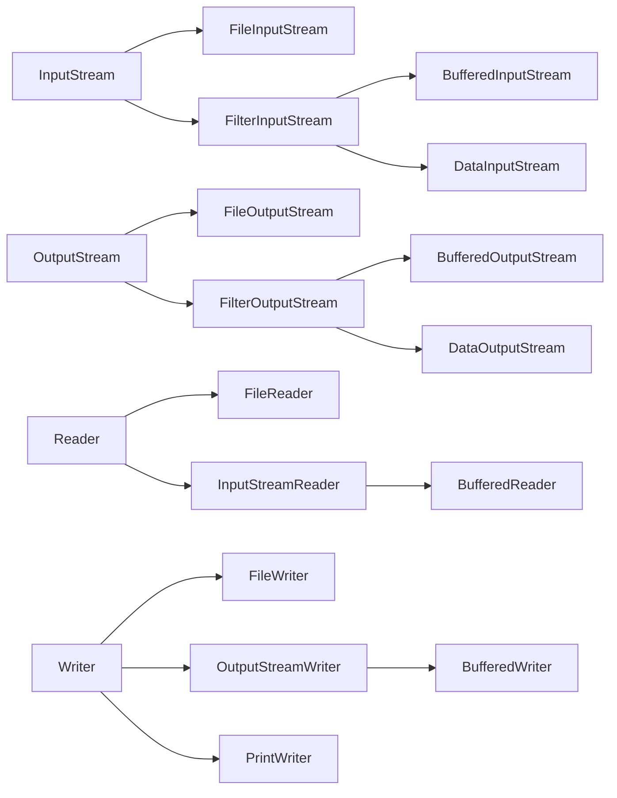

## 总结

**流**就是数据比特，其中带有`File`的就是文件相关的流，带有`buffered`就是有缓冲作用的流，通过缓存数据让数据一次性处理，可以**减少io操作**进而增加传输速度。但同时在发送时需要注意`flush()`，也就是让没有达到发送门槛的数据发送，否则如果后面没有数据会导致**数据无法发送** **Data**相关是封装了byte的流，也就是可以接受和返回int等类型的流，无需再转成byte或者从byte换成各种类型（这样确实方便
**Reader**和**Writer**是在原来的基础上更加注重`文本编码`，同时处理的是字符而不是byte。其子类`InputStreamReader`和`InputStreamReader`将以**流**和**编码类型**为参数实例化
最后所有创建的类都要注意`close()`来关闭资源

下面是类的关系图



## 基类输入输出流

`java.io.OutputStream` 抽象类
有方法如下

```java
// 仅写入一个字节
abstract void write(int b)
// 写入大量数据
void write(byte[] data)
// 可以设置偏移和写入的大小
void write(byte[] data, int offset, int length)
// 发送缓存的数据
void flush()
// 关闭流
void close()
```

在实际写入过程中，数据需要达到一定量才会发送，使用`flush()`可以使得没有达到门槛的数据**立即发送**。

`java.io.InputStream` 同为抽象类
有方法如下

```java
abstract int read()
// 读入1字节内容 返回这个字节转换成int类型 在末尾则返回-1
// 使用这个需要手动将int转换为无符号字节
int read(byte[] input)
// 可以设置偏移和读入的大小
int read(byte[] input, int offset, int length)
// 跳过不读取
long skip(long n)
// 返回可以读取的最少字节数
int available()
// 关闭流
void close()
```

## 缓冲流

`BufferedInputStream`是`InputStream`的一个子类，它会在内存中添加一个缓冲区，当从`BufferedInputStream`读取数据时，首先尝试从缓冲区中获取数据，当缓冲区中的数据被耗尽时，`BufferedInputStream`才会从底层数据源读取更多的数据填充缓冲区。这种方法**减少了实际的I/O操作次数**，从而提高了性能。
`BufferedInputStream(InputStream in)`
`BufferedInputStream(InputStream in, int bufferSize)`

相应的，`BufferedOutputStream`是`outputStream`的一个子类，写入时也会创建缓冲区，因此发送数据需要手动刷新输出流，即`flush()`

## 数据流

`DataInputStream`封装了`FilterInputStream`可以处理特定的类型
并且所有方法都被`final`修饰了，无法再被重写
构造函数`public DataInputStream(InputStream in)` **需要以输入流为参数**
可以读取对应类型的函数

```java
final int read(byte[] b)
final int read(byte[] b, int off, int len)
 final int readUnsignedByte()
public final short readShort()
public final int readUnsignedShort()
public final char readChar()
public final int readInt()
public final long readLong()
public final float readFloat()
public final double readDouble()
public final String readUTF()
public final boolean readBoolean
public final byte readByte()
public final void readFully(byte[] b)
```

`DataWriteStream`相同

## `Reader`和`Writer`

二者都是抽象类，作用是把流的byte转换为文本，与原来的`DataxxStream`不同点在于其子类处理的是字符而非byte，也更注重`文本编码`（上面的最多只有`utf-8`
相同的
读取文件时使用带有`File`的子类`FileReader("input.txt")`和`FileWriter("output.txt")`使用文件路径作为参数

二者子类`InputStreamReader`和`OutputStreamWriter`将流作为参数，同时需要指定`文本编码`即

```java
Writer writer = new OutputStreamWriter(outputStream out, "UTF-8");
writer.write("Hello, World!");
writer.close();
Reader reader = new InputStreamReader(InputStream in, "UTF-8");
char[] buffer = new char[1024];
int length;
while ((length = reader.read(buffer)) != -1) {
    System.out.print(new String(buffer, 0, length));
}
```

此外两个子类还有子类 `BufferedReader`和`BufferedWriter` 同样是缓冲功能 提高效率，同时`BufferedReader`可以使用`readLine()`读取一行

```java
Reader reader = new BufferedReader(new FileReader("input.txt"));
String line;
while ((line = reader.readLine()) != null) {
    System.out.println(line);
}
reader.close();
```
