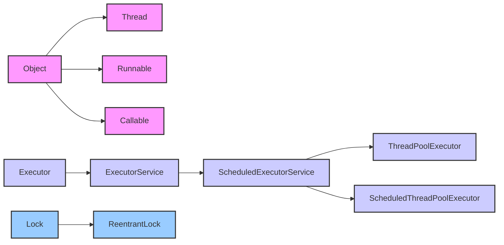

## 总结

线程是比进程更小的执行单位，

```mermaid
graph LR
    classDef base fill:#f9f,stroke:#333,stroke-width:2px
    classDef executor fill:#ccf,stroke:#333,stroke-width:2px
    classDef lock fill:#9cf,stroke:#333,stroke-width:2px

    Object[Object]:::base --> Thread[Thread]:::base
    Object[Object]:::base --> Runnable[Runnable]:::base
    Object[Object]:::base --> Callable[Callable]:::base

    Executor[Executor]:::executor --> ExecutorService[ExecutorService]:::executor
    ExecutorService[ExecutorService]:::executor --> ScheduledExecutorService[ScheduledExecutorService]:::executor
    ScheduledExecutorService[ScheduledExecutorService]:::executor --> ThreadPoolExecutor[ThreadPoolExecutor]:::executor
    ScheduledExecutorService[ScheduledExecutorService]:::executor --> ScheduledThreadPoolExecutor[ScheduledThreadPoolExecutor]:::executor

    Lock[Lock]:::lock --> ReentrantLock[ReentrantLock]:::lock
```
