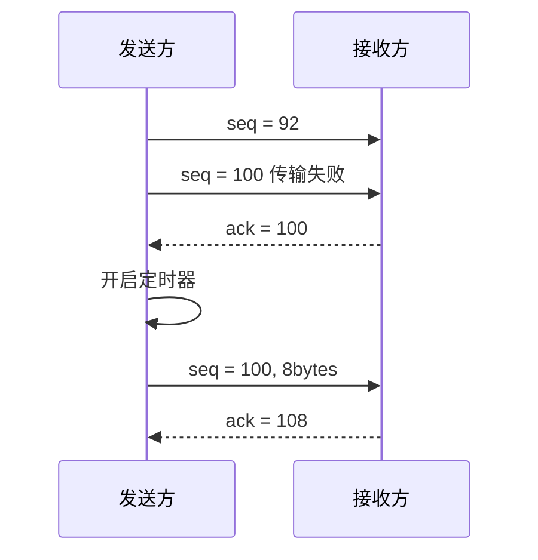
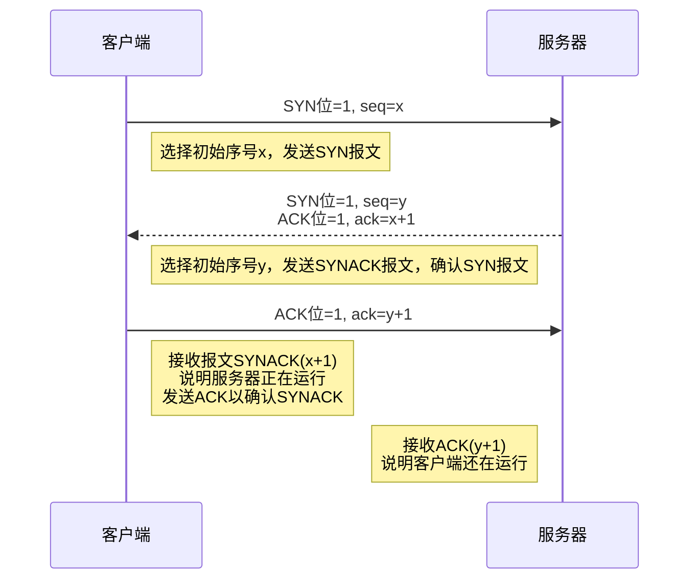
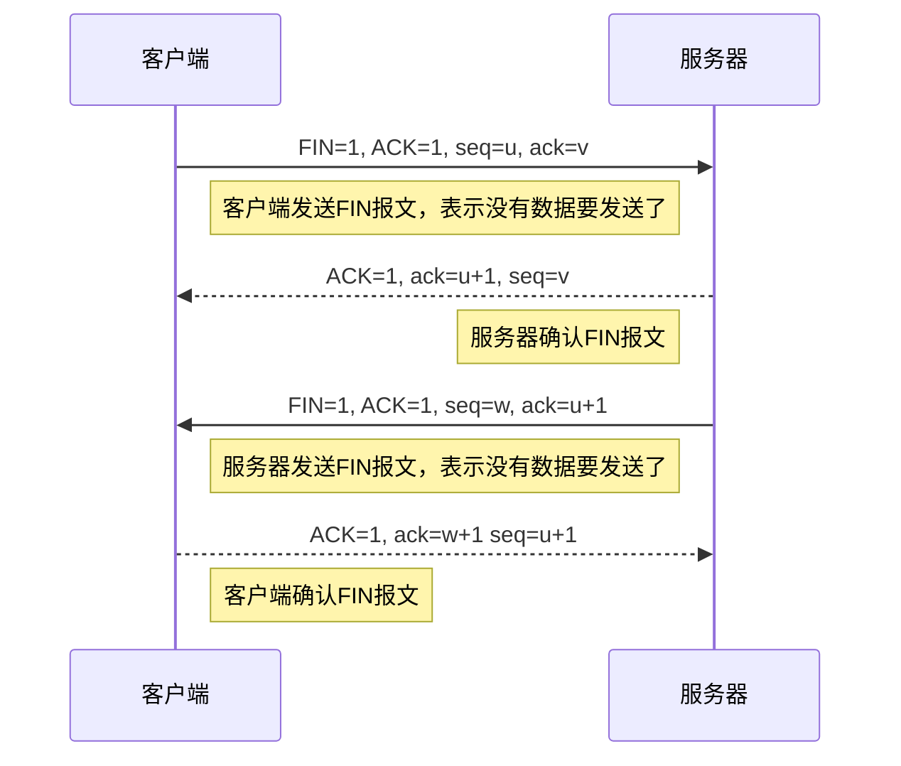

- 传输层概述与UDP
  需求/服务/协议、多路复用/分解、UDP协议
- 可靠传输
  可靠传输基础知识、TCP可靠传输
- TCP
  报文段结构、超时间隔、流量控制、连接管理
- TCP拥塞控制
  网络拥塞、TCP拥塞控制、吞吐量分析

## 传输层概述

| 应用层需求                               | 传输层服务   | UDP | TCP |
| ---------------------------------------- | ------------ | --- | --- |
| 为运行在不同主机上的进程之间提供逻辑通信 | 进程间交付   | ✓   | ✓   |
| 检测报文段是否出错                       | **差错检测** | ✓   | ✓   |
| 解决去包、差错问题                       | 可靠传输     | ×   | ✓   |
| 解决乱序问题                             | 按序交付     | ×   | ✓   |
| 解决接收缓存溢出问题                     | 流量控制     | ×   | ✓   |
| 应对网络拥塞                             | 拥塞控制     | ×   | ✓   |

## 可靠传输

### **GBN(Go-Back-N)**

**发送方**

- 初始化一个大小为 N 的滚动窗口,其中 `base` 表示窗口的起始序号,`nextSeqNum` 表示下一个要发送的序号。
- 发送窗口内的数据包,并更新 `nextSeqNum`。
- 当 `nextSeqNum` 达到 `base + N` 时,开启定时器。
- 收到 ACK 时,更新 `base` 并重启定时器。
- 如果定时器超时,从 `base` 重新发送整个窗口内的数据包。
- 可以采用累积确认的方式,即收到序号为 n 的 ACK 时,表示已正确接收到序号小于等于 n 的所有数据包,此时更新 `expectedSeqNum` 为 n+1。

**接收方**

- 定义一个期望的序号 `expectedSeqNum`。
- 收到数据包时,检查其序号是否等于 `expectedSeqNum`,如果是,则接收并发送 ACK,同时 `expectedSeqNum++`，如果不是仍然发送带有`expectedSeqNum`的ACK，这是为了告诉发送方目前期待的包序号为`expectedSeqNum`
- 如果序号不等于 `expectedSeqNum`,则丢弃该数据包。
  回退N步就体现在，当有接受方的ACK丢失时，发送方就重新发送`[base, base + N]`的包

### **选择重传**

思路相对简单
发送方将数据全部发送，然后打开定时器并记录接收方发送的ACK
接收方接收到数据，发送对应的ACK，否则就不发送，等待发送方的计时器结束

## TCP

### 流程

利用了校验和、确认、序号、定时器、流水线等 技术
序号：基于字节流，报文段数据首字节的字节流 编号
确认号：已确认的最大序号加一，含义是：期望 从对方收到的下一个字节的序号
确认机制：累积确认（类似回退N步）
重传：只重传丢失或损坏的分组（类似选择重传）
快速重传：连续发送三个相同序号的ACK
定时器：针对窗口中最早未确认的分组
是**回退N步和选择重传的混合体**

一个包丢失的情况

### **建立连接(三次握手)**

目的：

- 使双方知道对方的存在
- 协商参数（rwnd）
  握手的关键字段是**SYN**

1. **第一次握手(C->S)**：
   - 客户端选择一个初始序列号`x`，并发送一个**SYN**（Synchronize）报文给服务器。
     SYN=1，seq=x
1. **第二次握手(S->C)**：
   - 服务器收到SYN报文后，选择一个初始序列号`y`，并发送一个SYN=1报文给客户端。SYN=1，ACK=1，seq=y，ack=x+1
1. **第三次握手(C->S)**：
   - 客户端收到SYN报文后，发送一个ACK=1报文给服务器，确认号`seq=y+1`，表示确认收到服务器的SYNACK报文，连接建立完成。
     ACK=1，ack=y+1

握手过程中，客户端仅仅消耗一个序号
[三次握手B站视频](https://www.bilibili.com/video/BV1h7411a788/?spm_id_from=333.337.search-card.all.click&vd_source=dff18ebeabe62977b91c601c3cfdeea9)

- 第三次握手是否多余？
  如果没有第三次握手，客户端在网络不畅的情况下发送建立连接的请求，没有相应后会发起第二次请求，传输完成后，第一次请求如果被服务端接收，因为客户端已经无意建立连接，服务器发送的建立连接请求会被忽略，从而导致服务端一直挂起，产生了不必要开销

### **断开连接(四次挥手)**

挥手的关键字段是**FIN**

1. **第一次挥手(C-S)**：客户端发送一个FIN（终止）报文，序列号为`u`，表示它已经没有数据要发送了。
   FIN=1, ACK=1, seq=u, ack=v

2. **第二次挥手(S-C)**：服务器收到FIN报文后，发送一个ACK报文，确认号为`u+1`，表示它收到了客户端的FIN报文。
   ACK=1, ack=u+1, seq=v

3. **第三次挥手(S-C)**：服务器发送一个FIN报文，序列号为`v`，表示它也没有数据要发送了。
   FIN=1, ACK=1, seq=w, ack=u+1

4. **第四次挥手(C-S)**：客户端收到服务器的FIN报文后，发送一个ACK报文，确认号为`v+1`，表示它收到了服务器的FIN报文。此时，连接正式关闭。
   ACK=1, ack=w+1 seq=u+1
   第二次和第三次挥手之间，服务端可能还会传输数据，大小为**w-v**
   第三次挥手之后，客户端需要等待一段时间(两倍的**MSL**) 防止第三次报文丢失 导致服务端无法结束连接

[四次挥手B站视频](https://www.bilibili.com/video/BV1v741167NW/?spm_id_from=333.788.recommend_more_video.-1&vd_source=dff18ebeabe62977b91c601c3cfdeea9)

![[TCP练习.png]]

### **流量控制**

接受方希望可以控制发送方的发送速度
TCP 使用滑动窗口机制来实现流量控制

1. 接收方告知发送方自己的接收窗口大小(rwnd, Receive Window)
2. 发送方发送数据时,只能发送窗口内的数据
3. 每收到一个确认(ACK),发送窗口就向前滑动到ACK的序号位
   发送多少要取`min(rwnd, 拥塞窗口大小)`
   已发送未确认（没有收到对应ACK）的字节数 <= rwnd
   即 LastByteSent – LastByteAcked <= rwnd
   [流量控制B站视频](https://www.bilibili.com/video/BV1Lb411G7J1/?spm_id_from=333.337.search-card.all.click&vd_source=dff18ebeabe62977b91c601c3cfdeea9)

### **拥塞控制**

慢启动阈值（Slow-Start Threshold）当出现超时时，sst变为原始的一半
MSS （Maximum Segment Size 最大分段大小）MSS 的主要作用是限制每个 TCP 段中所包含的用户数据的大小，从而避免在网络传输过程中因为过大的数据段导致的分片（fragmentation）问题。

- 如何增加cwnd（Congestion Window 拥塞窗口）？
  线性增加(拥塞避免)： 每个RTT增加一个MSS 增长速度慢，但一旦发生拥塞损失小
  指数增加(慢启动)： 每个RTT增加一倍MSS 增长速度快，但一旦发生拥塞损失大
  最好先指数增加，超过一定阈值以后线性增加
- 丢包时，如何降低cwnd？
  定时器超时 说明拥塞 将cwnd降为初始值，进入慢启动（指数增长）阶段
- 收到3个冗余ACK
  虽然某个分组丢失了，但有些分组被收到了，说明拥塞 不是很严重
  将cwnd减半，进入拥塞避免（线性增长）阶段
  ![[拥塞控制.png|500]]

### 吞吐量分析

因为网络原因，有效吞吐量和理想的吞吐量指之间因为有网络延迟而不同
$$\text{有效吞吐量}=\frac{数据量W}{\frac{数据量W}{理想链路速率}*RTT}$$
