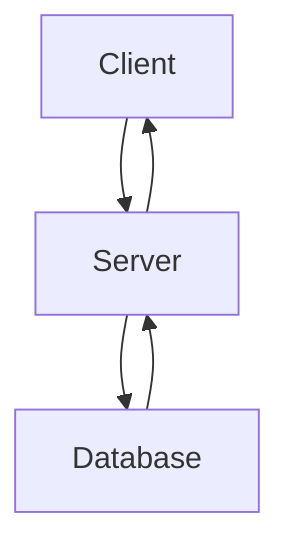
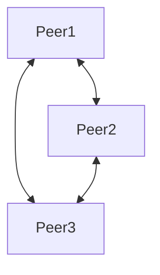
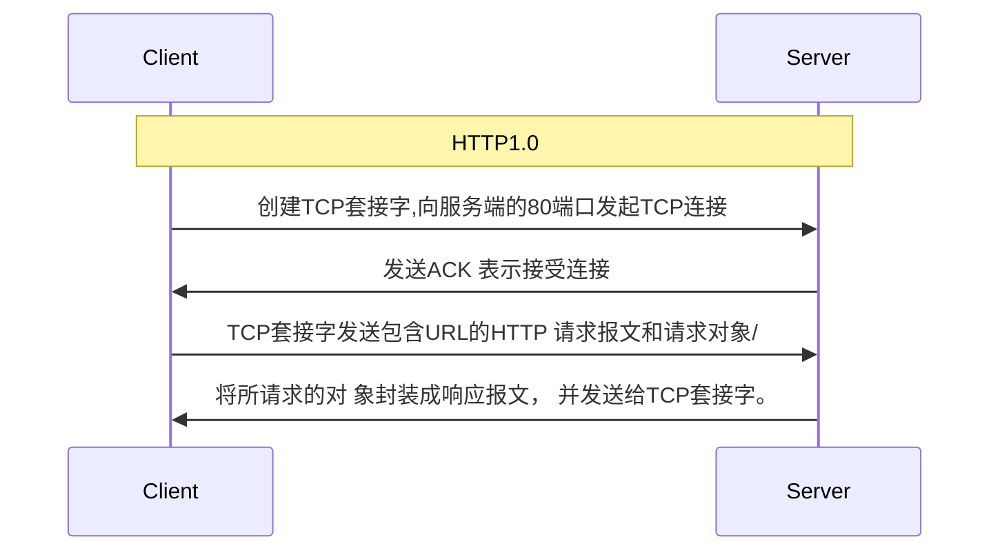
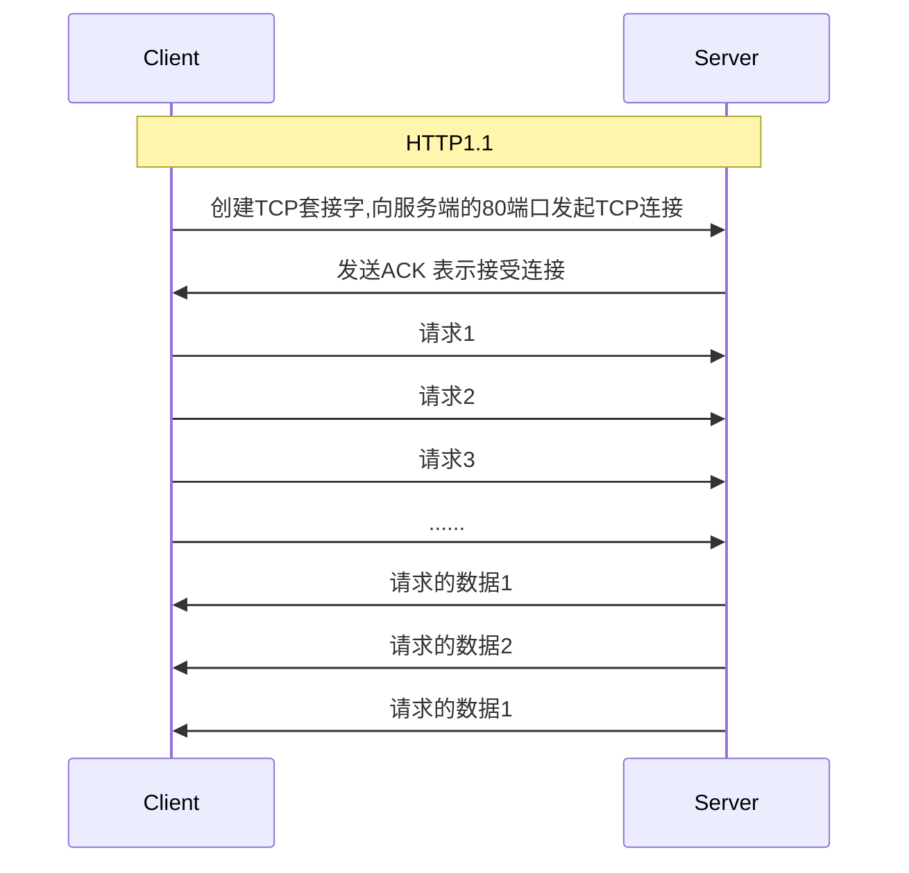
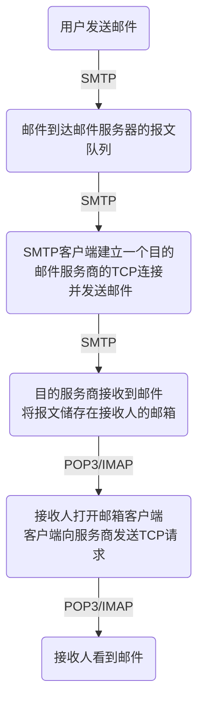
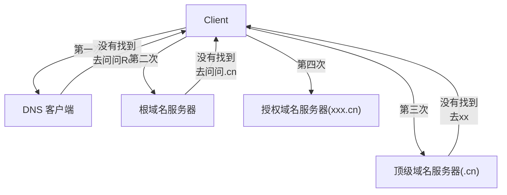
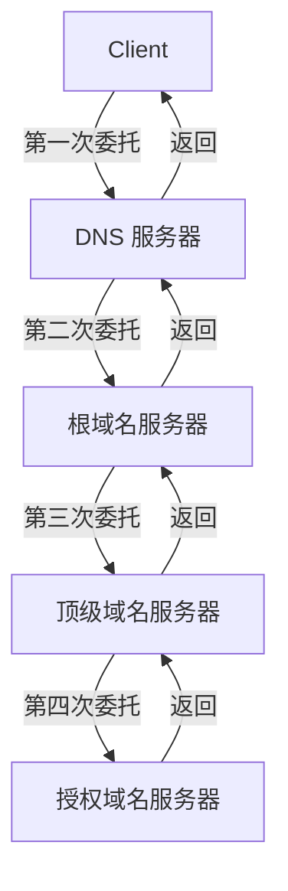

## 总结

- 应用层概述
  客户/服务器架构，P2P架构，套接字
- FTP
- Web 和 HTTP
  非持续HTTP，持续HTTP，响应时间，请求/响应报文
- Email
  SMTP，POP3，IMAP

* DNS 域名系统
  层级结构，迭代查询，递归查询

## 架构概述

### **客户/服务器架构**



- 特点:
  - 明确的角色划分,客户端发起请求,服务器提供服务。
  - 服务器负责资源的管理和访问控制。
  - 客户端依赖于服务器提供的功能和数据。
  - 客户端和服务器之间通过网络连接进行通信。

2. P2P架构:



- 特点:
  - 没有明确的服务器,各节点(peer)地位平等。
  - 节点既可以作为客户端,也可以作为服务器。
  - 节点直接相互连接和交换数据,无需中心服务器。
  - 节点自主管理资源和连接,具有更好的灵活性。
  - 适用于分布式、协作性强的应用场景。

3. 套接字(Socket):

- 套接字是网络通信的抽象概念,用于描述 IP 地址和端口号。
- 套接字提供了应用程序与网络协议之间的接口,屏蔽了底层实现细节。
- 常见的套接字类型有 Stream Socket (TCP) 和 Datagram Socket (UDP)。
- 套接字API提供了丰富的功能,如连接建立、数据收发、状态查询等。
- 套接字是客户/服务器架构和P2P架构实现网络通信的基础。

## HTTP链接

- RTT（Round Trip Time）：一个非常小的分组从客户端传输 到服务器，再返回来所需要的往返时间

### 内容

HTTP头报文由请求行或状态行、多个首部字段、一个空行和可选的请求体或响应体组成。

### 请求头（Request Headers）

1. **请求行（Request Line）**：

   - 包含请求方法、请求目标（URI）和HTTP版本。
   - 格式：`<method> <request-target> <HTTP-version>`
   - 例如：`GET /index.html HTTP/1.1`

2. **首部字段（Header Fields）**：

   - 包含多个键值对，用于传递请求的元信息。
   - 格式：`<field-name>: <field-value>`
   - 常见的请求头字段包括：
     - `Host`: 指定服务器的域名（必须字段）
     - `User-Agent`: 客户端软件的信息
     - `Accept`: 客户端可接受的MIME类型
     - `Accept-Encoding`: 可接受的内容编码（如gzip）
     - `Connection`: 连接管理（如`keep-alive`或`close`）
     - `Authorization`: 身份验证信息

3. **空行**：

   - 用于分隔请求头和请求体（如果有请求体的话）。

4. **请求体（Request Body）**（可选）：
   - 包含请求的实际数据（如POST请求中的表单数据）。

```http
GET /index.html HTTP/1.1
Host: www.example.com
User-Agent: Mozilla/5.0 (Windows NT 10.0; Win64; x64)
Accept: text/html,application/xhtml+xml,application/xml;q=0.9,image/webp
Accept-Encoding: gzip, deflate, br
Connection: keep-alive
```

### 响应头（Response Headers）

1. **状态行（Status Line）**：

   - 包含HTTP版本、状态码和状态描述。
   - 格式：`<HTTP-version> <status-code> <reason-phrase>`
   - 例如：`HTTP/1.1 200 OK`

2. **首部字段（Header Fields）**：

   - 包含多个键值对，用于传递响应的元信息。
   - 格式：`<field-name>: <field-value>`
   - 常见的响应头字段包括：
     - `Date`: 生成响应的日期和时间
     - `Server`: 服务器软件的信息
     - `Content-Type`: 响应内容的MIME类型
     - `Content-Length`: 响应内容的长度
     - `Connection`: 连接管理（如`keep-alive`或`close`）
     - `Set-Cookie`: 设置HTTP cookie

3. **空行**：

   - 用于分隔响应头和响应体。

4. **响应体（Response Body）**（可选）：
   - 包含实际的响应数据（如HTML文档、图像、JSON数据等）。

```http
HTTP/1.1 200 OK
Date: Mon, 10 Jun 2024 12:00:00 GMT
Server: Apache/2.4.41 (Ubuntu)
Content-Type: text/html; charset=UTF-8
Content-Length: 1234
Connection: keep-alive

<html>
    <head><title>Example</title></head>
    <body><h1>Hello, World!</h1></body>
</html>
```

### **非持续HTTP(HTTP1.0)**

仅对一个对象进行传输，没有等待，请求完成后自动关闭  
**HTTP响应时间** = **建立TCP连接所需的RTT** + **HTTP请求/响应所需的RTT** + **对象传输时间**
= 2RTT + 传输时间  
一个用于建立连接，一个用于断开连接



### **持续HTTP（HTTP1.1）**

在需要传输的数据较多时，非连接HTTP**每传输一个就要断开重连**，有很多不必要的开销  
**一个TCP连接用于请求/响应多个对象**
每个对象的HTTP响应时间 = RTT + 传输时间  
仅需要建立连接  
流程中，类似**流水线的工作方式**，在一个对象请求的响应到达之前，发送 其他对象的请求。



### 信道利用率

信道利用率=信道被占用的时间/周期=𝑛个分组的传输时间/传输一对分组使用及确认的时间  
$$=\frac{nT}{T+RTT+T_{A}}$$
其中$T_A$ 是处理ACK使用的时间，有时会忽略ACK的时间

## 文件传输

### FTP（File Transfer Protocol）

使用两个端口进行通信：**控制端口**（通常是21）用于命令和响应，**数据端口**（动态分配）用于实际的数据传输。
客户端使用控制端口（21）与FTP服务器建立连接，进行用户认证。

## Email

一个邮件从发送到接收的过程如下



这个过程中 三个协议起着不同的作用

- SMTP (Simple Mail Transfer Protocol):
  - 只支持传输 7 比特 ASCII 码内容
    - 支持在邮件服务器之间发送邮件
    - SMTP 负责邮件的发送和中继传输。
    - 当用户发送邮件时,邮件客户端会使用 SMTP 协议将邮件发送到 SMTP 服务器。
    - SMTP 服务器会根据收件人地址,将邮件转发给目标域的 SMTP 服务器。
- POP3 (Post Office Protocol version 3):
  - POP3 协议负责邮件的接收和下载。
  - 当收件人想要读取邮件时,邮件客户端会**使用 POP3 协议连接到收件人的邮箱服务器**。
- IMAP (Internet Message Access Protocol):
  - IMAP 协议也负责邮件的接收,但IMAP 允许收件人在服务器上管理和访问邮件。
  - 收件人可以在服务器上查看、回复、删除邮件,而不需要将邮件完全下载到本地。

## DNS域名系统（Domain Name System）

**IP**对于人来说比较难记，因此就出现了**域名**，电脑实际上是不认识域名的，这里就需要将域名转换为**IP**.


当主机做DNS查询时，请求会**先发往本地域名服务器**，域名地址映射也会有缓存，使得经常被访问的地址可以不用查找，  
代理查询: 委托DNS服务器查找

- 迭代查询
  - 减轻了根域名服务器和顶级域名服务器的负载。
  - 客户端可以自主控制查询过程,提高了灵活性。



- 递归查询
  - 对客户端来说更加简单,不需要自己控制查询过程。
  - 可以缓存查询结果,提高后续查询的速度。


